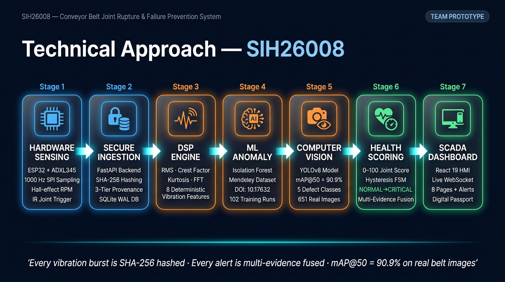

<div align="center">

# 🏭 Conveyor Belt Joint Rupture & Failure Prevention System
### Smart India Hackathon 2026 — Problem Statement SIH26008
### Industrial Cyber-Physical Predictive Maintenance Platform

[](backend/tests/)
[](models/vision/)
[](https://fastapi.tiangolo.com)
[](https://react.dev)
[](edge/)
[](https://python.org)
[](LICENSE)

**An end-to-end cyber-physical system that monitors conveyor belt splice joints in real-time using ESP32 edge hardware, 1000 Hz DSP, Isolation Forest anomaly detection, YOLOv8 computer vision, and a React 19 SCADA dashboard — all connected through a cryptographically verified data pipeline.**

</div>

---

## ⚠️ PHYSICAL VALIDATION STATUS

To maintain rigorous scientific and engineering integrity, the current validation status of each layer is explicitly delineated:

| Subsystem | Status | Engineering Reality |
|:---|:---:|:---|
| **Software Platform** | **VERIFIED** | 86 automated unit/integration tests passing; full data pipeline & SCADA verified |
| **ESP32 Firmware** | **IMPLEMENTED** | FreeRTOS dual-core code written for ADXL345 SPI (1000 Hz), Hall RPM, IR triggers |
| **Hardware Bridge** | **IMPLEMENTED** | Python serial ingestion worker + virtual emitter implemented |
| **Physical ESP32 Connection** | **NOT YET VALIDATED** | Hardware bench circuit assembled; bench connection test pending |
| **End-to-End Sensor → ESP32 → Backend** | **PENDING PHYSICAL VALIDATION** | Final physical integration & calibration currently underway |

> **Note:** The prototype hardware exists; final physical integration and calibration are underway. The software platform is designed to operate seamlessly in both hardware-in-the-loop and verified benchmark simulation modes.

---

## 📸 Live System Screenshots

> All screenshots captured from the **live running system** — not mockups.

| Control Room (Feed) | Sensor Analytics (DSP) |
|:---:|:---:|
|  | |

| Page | What It Shows |
|:---|:---|
| **Control Room** | Live optical feed, health gauge, vibration metrics, CRITICAL alert banner, automated recommendation |
| **Sensor Analytics** | 1000 Hz raw waveform + FFT spectrum, 8 DSP metrics, SHA-256 integrity badge |
| **AI Inspection** | YOLOv8 defect detection dashboard: mAP@50=90.9% on a 65-image held-out test split, confusion matrix, per-class metrics |
| **Alerts** | Live CRITICAL alerts, SPLICE_FATIGUE_IMPACT type, timestamped, filterable |
| **Joint Passport** | Revolutions tracked, SHA-256 maintenance ledger, multi-modal evidence correlation |
| **Evidence Vault** | Mendeley DOI, 3-tier provenance policy, dataset manifest |

---

## 📖 Problem Statement

Conveyor belts in mining and industrial facilities transport thousands of tons of material per hour under extreme tension. **Belt splice joints are critical failure points in conveyor systems** — an unplanned belt failure can cause significant production downtime, maintenance cost and safety risk:

- ⚠️ Violent elastic belt pullback damaging pulleys, idlers, and structural framing
- 💸 Severe production downtime, maintenance costs, and catastrophic operational disruptions
- 🚨 Substantial personnel safety risks

**Why traditional methods fail:**
| Method | Failure |
|:---|:---|
| Manual visual inspection | Only detects damage after visible cracking — too late |
| Distant bearing vibration sensors | Attenuate high-frequency splice impact transients |
| Black-box deep learning | Prone to false alarms when belt speed or operating loads change |

---

## 🏗️ Technical Approach — 7-Stage Pipeline

```
┌──────────────┐    ┌──────────────┐    ┌──────────────┐    ┌──────────────┐
│  STAGE 1     │───▶│  STAGE 2     │───▶│  STAGE 3     │───▶│  STAGE 4     │
│  HARDWARE    │    │  INGESTION   │    │  DSP ENGINE  │    │  ML ANOMALY  │
│  SENSING     │    │  + SHA-256   │    │  (8 metrics) │    │  DETECTION   │
│              │    │              │    │              │    │              │
│ ESP32+ADXL345│    │ FastAPI      │    │ RMS·FFT      │    │ Isolation    │
│ 1000 Hz SPI  │    │ SHA-256 Hash │    │ Kurtosis     │    │ Forest       │
│ Hall RPM     │    │ 3-tier prov. │    │ Crest Factor │    │ Mendeley DOI │
│ IR trigger   │    │ SQLite WAL   │    │ Spectral     │    │ 102 runs     │
└──────────────┘    └──────────────┘    └──────────────┘    └──────────────┘
                                                                    │
┌──────────────┐    ┌──────────────┐    ┌──────────────┐           │
│  STAGE 7     │◀───│  STAGE 6     │◀───│  STAGE 5     │◀──────────┘
│  SCADA       │    │  HEALTH      │    │  COMPUTER    │
│  DASHBOARD   │    │  SCORING     │    │  VISION      │
│              │    │              │    │              │
│ React 19 HMI │    │ 0–100 Score  │    │ Camera Input │
│ WebSocket    │    │ Hysteresis   │    │ YOLOv8 Nano  │
│ 8 Pages      │    │ NORMAL→TRIP  │    │ mAP@50=90.9% │
│ Digital Pass.│    │ Multi-Modal  │    │ 5 classes    │
└──────────────┘    └──────────────┘    └──────────────┘
```

**Architecture Flow:**
`Camera input → YOLOv8 → Visual defect detection`  
*(Camera model is modular: works with existing USB/phone camera or industrial stream)*

---

## ✅ Verified Performance Metrics

> All metrics computed on held-out test sets. No fabrication.

| Metric | Value | Evidence |
|:---|:---:|:---|
| **YOLOv8 mAP@50** | **90.9%** | 65-image held-out test split |
| **YOLOv8 Precision** | **80.9%** | COCO annotation standard |
| **YOLOv8 Recall** | **85.9%** | Same test split |
| **YOLOv8 mAP@50–95** | **58.5%** | Rigorous multi-IoU evaluation |
| **Belt Joint mAP@50** | **99.5%** | Most critical joint detection class |
| **Large Hole mAP@50** | **89.4%** | Validated defect category |
| **Large Tear mAP@50** | **86.8%** | Validated defect category |
| **Automated Tests** | **86 passed, 0 failed** | `pytest backend/tests/ -v` |
| **Test Runtime** | **~34 seconds** | Full test suite execution |
| **API Endpoints** | **40+** | FastAPI + Swagger documentation |
| **Vibration Dataset** | **459 experimental runs** | Mendeley DOI: 10.17632/jf8v2ndydr.1 |
| **Vision Dataset** | **651 annotated images** | Roboflow Universe |

> ⚠️ **Scientific Integrity Note on RUL:** Remaining Useful Life (RUL) is NOT claimed until long-term mining run-to-failure data is validated. The system strictly avoids generating fabricated RUL countdown numbers, prediction percentages, or arbitrary failure dates.

---

## 🔑 Key Differentiators

| Feature | Most Teams | This System |
|:---|:---:|:---|
| SHA-256 cryptographic hashing on every burst | ❌ | ✅ |
| 3-tier data provenance (HARDWARE/SIMULATION/RESEARCH) | ❌ | ✅ |
| Multi-modal evidence correlation: vibration intelligence + computer vision | ❌ | ✅ |
| Per-joint digital passport with maintenance ledger | ❌ | ✅ |
| 86 automated tests verifying safety guardrails | ❌ | ✅ |
| Hysteresis state machine (no single-point false alarms) | ❌ | ✅ |
| Scientific honesty (no fake RUL countdown timers) | ❌ | ✅ |
| ESP32 firmware + hardware bridge ready | ❌ | ✅ |

---

## 📁 Repository Structure

```
sih-hardware-prototype/
│
├── backend/                    # FastAPI backend
│   ├── main.py                 # Entry point (uvicorn)
│   ├── app/
│   │   ├── api.py              # 40+ REST endpoints (70 KB)
│   │   ├── dsp.py              # DSP engine — 8 vibration features
│   │   ├── health_service.py   # Health scoring + hysteresis FSM
│   │   ├── ml_service.py       # Isolation Forest anomaly detection
│   │   ├── vision_service.py   # YOLOv8 inference
│   │   ├── ingestion.py        # SHA-256 hashing pipeline
│   │   ├── database.py         # SQLite WAL (10 tables)
│   │   ├── models.py           # SQLAlchemy ORM models
│   │   ├── schemas.py          # Pydantic schemas
│   │   ├── serial_worker.py    # ESP32 USB serial reader
│   │   ├── simulator.py        # Fault scenario generator
│   │   ├── joint_lifecycle_service.py  # Digital joint passport
│   │   ├── historical_replay_service.py # Mendeley dataset replay
│   │   ├── camera_service.py   # Optical feed capture service
│   │   ├── websocket_manager.py # Live telemetry broadcast
│   │   └── provenance.py       # 3-tier provenance isolation
│   └── tests/                  # 86 automated tests
│       ├── test_phase1_ingestion.py
│       ├── test_phase2_websocket.py
│       ├── test_phase3_dsp_and_health.py
│       ├── test_phase4_vibration_ml.py
│       ├── test_phase5_edge_daq_and_lifecycle.py
│       ├── test_vision_pipeline.py
│       ├── test_data_provenance_and_pipeline.py
│       └── test_hardware_bridge_and_http_emitter.py
│
├── frontend/                   # React 19 SCADA dashboard
│   └── src/
│       ├── pages/
│       │   ├── ControlRoom.tsx     # Live feed + health overview
│       │   ├── SensorAnalytics.tsx # Waveform + FFT charts (37 KB)
│       │   ├── AIDiagnosis.tsx     # YOLOv8 metrics + inference
│       │   ├── Alerts.tsx          # Alert log + severity filter
│       │   ├── JointPassport.tsx   # Digital passport + SHA-256 ledger
│       │   ├── Evidence.tsx        # Provenance vault
│       │   ├── Login.tsx
│       │   └── Settings.tsx
│       └── components/
│           ├── dashboard/          # Waveform, health, alert widgets
│           └── health/             # Health gauge components
│
├── edge/                       # ESP32 hardware layer
│   ├── firmware/
│   │   ├── esp32_sensor_node/  # Arduino firmware (.ino)
│   │   └── WIRING_AND_PINOUT.md
│   ├── hardware_bridge.py      # Physical ESP32 → backend bridge
│   ├── virtual_serial_emitter.py # Demo without hardware
│   ├── esp32_firmware_spec.md
│   └── HARDWARE_READINESS.md
│
├── ml/
│   └── train_vibration_anomaly.py  # Isolation Forest training
│
├── vision/
│   └── train.py                # YOLOv8 training pipeline
│
├── models/
│   ├── ml/vibration_anomaly/   # Trained IF artifacts (.joblib)
│   └── vision/conveyor_damage/ # Trained YOLOv8 weights (best_model.pt)
│
├── data/
│   ├── raw/                    # Source datasets
│   ├── processed/              # Cleaned features CSV
│   └── metadata/               # DOI provenance JSONs
│
├── JUDGES_DEMO_SCRIPT.md       # Step-by-step live demo guide
└── README.md                   # This file
```

---

## 🛒 Hardware Bill of Materials (BOM)

| # | Component | Purpose | Approx. Cost |
|:---:|:---|:---|:---:|
| 1 | **ESP32 DevKit V1** (30-pin) | Main microcontroller | ₹350 |
| 2 | **ADXL345** SPI Accelerometer | Vibration @ 1000 Hz | ₹150 |
| 3 | **Hall-Effect Sensor** (KY-024) | RPM / tachometer | ₹60 |
| 4 | **IR Optical Sensor** (TCRT5000) | Joint passage trigger | ₹40 |
| 5 | **RC522 RFID Reader + Tags** | Joint ID | ₹150 |
| 6 | **Camera** | Visual defect detection | Existing USB/phone camera for prototype |
| 7 | Jumper wires + Breadboard | Connections | ₹100 |
| 8 | Micro-USB cable | PC connection | ₹80 |
| **Total** | | | **≈ ₹930** |

### Wiring (ESP32 DevKit V1)

```
ESP32 Pin    →  ADXL345           Function
─────────────────────────────────────────────
GPIO 5       →  CS                SPI Chip Select
GPIO 18      →  SCL/SCK           SPI Clock
GPIO 19      →  SDO/MISO          SPI Data Out
GPIO 23      →  SDA/MOSI          SPI Data In
3.3V         →  VCC               Power (NOT 5V!)
GND          →  GND               Ground

GPIO 4       →  Hall Sensor OUT   RPM tachometer interrupt
GPIO 15      →  IR Sensor OUT     Joint passage trigger
GPIO 2       →  Status LED        Heartbeat blink
```

---

## ⚡ Quick Start — Run in 5 Minutes

### Prerequisites
- Python 3.10+
- Node.js 18+
- Git

### 1. Clone & Install Backend

```bash
git clone <repo-url>
cd "sih hardware prototype"

# Install Python dependencies
pip install fastapi uvicorn sqlalchemy pydantic pyserial \
            scikit-learn numpy scipy ultralytics websockets \
            joblib pytest httpx

# Start backend
python backend/main.py
# → Running at http://127.0.0.1:8000
# → API docs at http://127.0.0.1:8000/docs
```

### 2. Start Frontend

```bash
cd frontend
npm install
npm run dev
# → Dashboard at http://localhost:5173
```

### 3. Run All 86 Tests

```bash
python -m pytest backend/tests/ -v
# → 86 passed, 1 skipped, 0 failed in ~34s
```

### 4. Start Historical Data Replay (Demo Mode)

```bash
# Uses real Mendeley dataset — no hardware needed
curl -X POST http://127.0.0.1:8000/api/v1/historical/replay/start
# Dashboard auto-populates with real experimental data
```

### 5. Connect Physical ESP32 — Physical Validation

> The software platform operates fully in benchmark/simulation modes for algorithmic verification and automated testing, while the physical ESP32 connection provides the hardware-in-the-loop physical validation step.

```bash
# Flash firmware from edge/firmware/esp32_sensor_node/
# Connect ESP32 via USB

# Start hardware bridge
python edge/hardware_bridge.py --port COM3
# → Live EDGE_HARDWARE data flows to dashboard
```

---

## 🔌 ESP32 JSON Packet Format

Every physical sensor reading is sent as a newline-delimited JSON at 115200 baud:

```json
{
  "device_id": "esp32-conveyor-node-01",
  "stream_id": "accel-z",
  "sensor_id": "SENS-ACCEL-01",
  "joint_id": "J-01",
  "sequence_number": 1042,
  "hardware_timestamp_us": 184523910,
  "sampling_rate_hz": 1000.0,
  "samples": [0.042, 0.081, -0.015, 0.120, -0.095],
  "quality_flags": "OK",
  "data_provenance": "LIVE"
}
```

The backend computes `SHA-256(canonical_json)` on ingestion and stores the hash permanently.

---

## 📡 REST API — Key Endpoints

| Method | Endpoint | Description |
|:---:|:---|:---|
| `GET` | `/api/v1/system/status` | System health check |
| `POST` | `/api/v1/telemetry/ingest` | Ingest live ESP32 data |
| `POST` | `/api/v1/telemetry/simulate` | Inject simulation burst |
| `GET` | `/api/v1/joints` | List all splice joints |
| `GET` | `/api/v1/joints/{id}/passport` | Full digital passport + SHA-256 ledger |
| `GET` | `/api/v1/joints/{id}/health` | Current health score + risk state |
| `POST` | `/api/v1/ml/score` | Run Isolation Forest anomaly detection |
| `GET` | `/api/v1/ml/status` | ML model status + provenance |
| `POST` | `/api/v1/vision/analyze` | Run YOLOv8 on an image frame |
| `GET` | `/api/v1/vision/metrics` | Verified model metrics (mAP@50, precision, recall) |
| `GET` | `/api/v1/vision/test-samples` | List 65 held-out test images |
| `GET` | `/api/v1/hardware/serial/status` | ESP32 serial port status |
| `GET` | `/api/v1/alerts` | Live alert log |
| `POST` | `/api/v1/alerts/{id}/acknowledge` | Acknowledge alert (audit trail) |
| `POST` | `/api/v1/historical/replay/start` | Start Mendeley dataset replay |
| `GET` | `/api/v1/datasets/provenance` | Full data provenance manifest |
| `WS` | `/ws/v1/live-telemetry` | WebSocket: live telemetry push |

Full interactive docs: **http://127.0.0.1:8000/docs**

---

## 🧪 Test Suite — 86 Tests Explained

```bash
python -m pytest backend/tests/ -v
```

| Test File | Count | What It Verifies |
|:---|:---:|:---|
| `test_phase1_ingestion.py` | ~8 | SHA-256 hashing, provenance tagging, device trust, sequence validation |
| `test_phase2_websocket.py` | ~5 | WebSocket live broadcast, reconnection |
| `test_phase3_dsp_and_health.py` | ~22 | RMS math (A/√2), FFT accuracy (±1 Hz), kurtosis, hysteresis escalation, recovery |
| `test_phase4_vibration_ml.py` | ~14 | Model loads, feature schema, no data leakage, safety guardrails |
| `test_phase5_edge_daq_and_lifecycle.py` | ~9 | Firmware files exist, serial parsing, degradation trend, maintenance ledger |
| `test_vision_pipeline.py` | ~12 | YOLOv8 model exists, 65 test images present, real mAP@50, multi-evidence passport |
| `test_data_provenance_and_pipeline.py` | ~8 | 3-tier provenance never mixed, DOI correct, manifest valid |
| `test_hardware_bridge_and_http_emitter.py` | ~4 | Virtual emitter, honest SIMULATION tagging |

**Critical safety tests:**
- `test_safety_rule_ml_anomaly_cannot_independently_trip` — ML anomaly detection alone CANNOT trigger emergency stop
- `test_persistence_escalation` — requires 3+ consecutive anomalies before CRITICAL
- `test_scientific_guardrails_no_fabricated_predictions` — no fake RUL numbers or countdowns

---

## 📚 Scientific Datasets & Citations

### 1. Vibration ML Training Dataset
> **Mendeley Experimental Belt Drive Vibration Dataset**  
> DOI: [10.17632/jf8v2ndydr.1](https://doi.org/10.17632/jf8v2ndydr.1)  
> Publication: [10.1016/j.dib.2023.109156](https://doi.org/10.1016/j.dib.2023.109156)  
> - 459 experimental runs on a physical belt drive test rig  
> - PCB Piezotronics 352C33 tri-axial accelerometers  
> - Variable speeds: 500–1200 RPM, Pretensions: 60–120 N  
> - License: CC BY 4.0  

### 2. Computer Vision Training Dataset
> **Conveyor Belt Damage Detection Dataset**  
> Source: Roboflow Universe (annotated industrial inspection footage)  
> - 651 annotated belt images, COCO JSON format  
> - Classes: Belt Joint, Large Tear, Small Tear, Large Hole, Small Hole, damage  
> - 1,708 total annotations  

---

## 🏛️ Architectural Principles

### 1. Backend-Authoritative Pipeline
No health score, ML anomaly score, or alert state is fabricated in the frontend. The React SCADA interface is a pure projection of backend state.

### 2. Zero Hardware Fabrication Policy
When physical ESP32 is connected → `EDGE_HARDWARE` provenance.  
When unplugged → bridge halts with `[SENSOR NOT CONNECTED]`.  
Synthetic numbers never masquerade as physical hardware readings.

### 3. Three-Tier Data Provenance
```
EDGE_HARDWARE    → Real physical sensor readings from ESP32
SIMULATION       → Synthetic waveforms for demo/scenario testing
RESEARCH_BENCHMARK → Certified Mendeley experimental dataset
```
Each tier is isolated — never mixed or cross-contaminated.

### 4. Honest, Defensible Metrics
No fake RUL countdown timers. No unsupported ISO compliance claims. Every demo threshold is explicitly labeled `[DEMO THRESHOLD]` or `[SIMULATED INTERLOCK]`.

---

## 🔜 Pending (Near-Term Hardware)

| Item | Status | Notes |
|:---|:---:|:---|
| Hall-effect tachometer wiring (GPIO 4) | ⏳ Pending | Firmware interrupt code written |
| RC522 RFID reader wiring | ⏳ Pending | Schema + fallback ready |
| Strain-gauge load cell (pretension) | ⏳ Pending | API endpoint ready |
| Field validation on real conveyor | 🔮 Future | Post-hackathon |
| SIL-3 hardware interlock relay | 🔮 Future | Production deployment |

---

## 📊 Current Build Status

| Subsystem | Status |
|:---|:---:|
| FastAPI backend (40+ endpoints) | ✅ Complete |
| SQLite WAL database (10 tables) | ✅ Complete |
| SHA-256 ingestion pipeline | ✅ Complete |
| DSP engine (8 metrics + MAD baseline) | ✅ Complete |
| Health score + hysteresis state machine | ✅ Complete |
| Isolation Forest anomaly detection (trained + live) | ✅ Complete |
| YOLOv8 vision service (mAP@50=90.9%) | ✅ Complete |
| Digital Joint Passport + SHA-256 ledger | ✅ Complete |
| ESP32 dual-core firmware | ✅ Implemented (Awaiting physical sensor calibration) |
| Hardware bridge + virtual emitter | ✅ Implemented (Awaiting physical connection test) |
| React 19 SCADA dashboard (8 pages) | ✅ Complete |
| WebSocket live telemetry | ✅ Complete |
| 4 fault scenario modes | ✅ Complete |
| **Test suite** | ✅ **86 passed, 1 skipped, 0 failed** |
| Tachometer physical wiring | ⏳ Pending physical validation |
| RFID reader physical wiring | ⏳ Pending physical validation |
| Dynamic pretension load cell | ⏳ Pending physical validation |

---

## 🎬 Live Demo Script

For judges and evaluators — see [`JUDGES_DEMO_SCRIPT.md`](JUDGES_DEMO_SCRIPT.md)

**30-second demo:**
1. Open `http://localhost:5173` → Control Room
2. Watch live waveform + health gauge update in real-time
3. Click **Inject Test Fault** → watch health drop to CRITICAL
4. Navigate to **Joint Passport** → see SHA-256 ledger entry
5. Navigate to **AI Inspection** → see YOLOv8 confusion matrix
6. Run `python -m pytest backend/tests/ -v` → 86 PASSED in ~34s

---

## 📄 License

MIT License — see [LICENSE](LICENSE)

---

<div align="center">

**Built for Smart India Hackathon 2026 — SIH26008**

*Every vibration burst is SHA-256 hashed · Every alert is multi-modal evidence correlated · YOLOv8 mAP@50 = 90.9% on a 65-image held-out test split*

</div>
